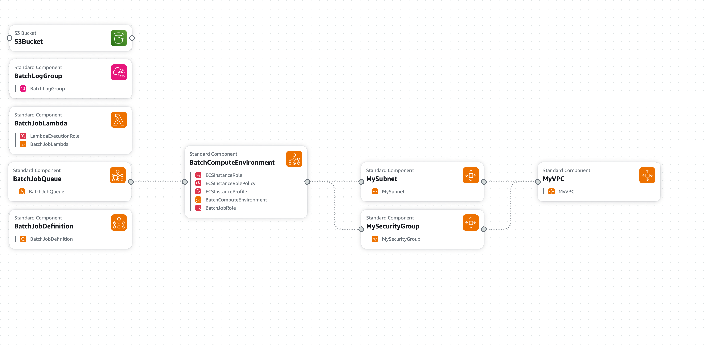

# AWS Batch tests

Test of AWS batch jobs submitted from a lambda function.



```bash
zip code.zip lambda_function.py
aws s3 cp code.zip s3://awstests-lavkge/src/code.zip

YAML_CONF=file://stack.yaml

aws cloudformation create-stack --stack-name NOAAFargateJobStack --template-body $YAML_CONF --capabilities CAPABILITY_NAMED_IAM

aws cloudformation update-stack \
  --stack-name NOAAFargateJobStack \
  --template-body $YAML_CONF \
  --capabilities CAPABILITY_NAMED_IAM
```
